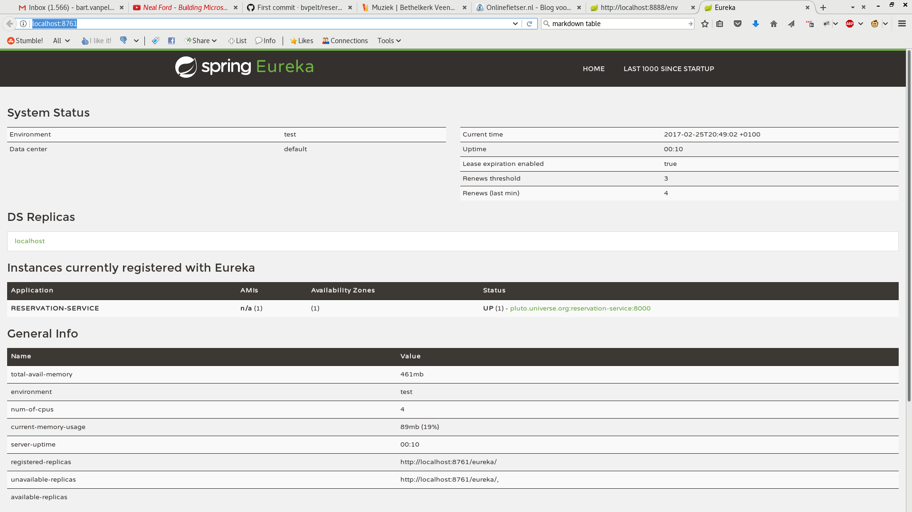

# Eureka service
This service is used for service discovery

## Setup
The configuration server has a configuration for the eureka server: eureka-service.properties.
The minimal needed parameters for bootstrapping are defined in bootstrap.properties
```
spring.application.name=eureka-service
sprint.cloud.config.uri=http://localhost:8888/
```
All other parameters are obtained by querying the configuration server `http://localhost:8888/eureka-service.properties`.
This returns the complete configuration for the eureka-service, which is stored in the reservation-repo github repository.
```
debug: true
endpoints.jmx.enabled: false
endpoints.shutdown.enabled: true
eureka.client.fetch-registry: false
eureka.client.register-with-eureka: false
info.id: ${spring.application.name}
logging.level.com.netflix.discovery: OFF
logging.level.com.netflix.eureka: OFF
logging.level.org.springframework.security: DEBUG
logging.pattern.console: %clr(%d{yyyy-MM-dd HH:mm:ss.SSS}){faint} %clr(%5p) %clr(-){magenta} %clr(---){faint} %clr([trace=%X{X-Trace-Id:-},span=%X{X-Span-Id:-}]){yellow} %clr([%15.15t]){faint} %clr(%-40.40logger{39}){cyan} %clr(:){faint} %m%n%wex
server.port: 8761
spring.jmx.enabled: false
spring.jpa.generate-ddl: true
spring.sleuth.log.json.enabled: true
spring.sleuth.sampler.percentage: 1.0
```
The default endpoint `http://localhost:8761/` (portnumber comes from the configuration server) shows an overview of available services. 
An example of the registered registration-server is shown here.



